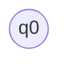
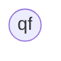

# AUTÓMATAS
> *Este es un repositorio para ayudar a los alumnos de las secuencias Teoría de la Computación (TC) y Compiladores, con el fin reforzar los conocimientos adquiridos en clase.*

## Definiciones y Conceptos
**¿Por donde comenzar?**, Aprendamos los términos  básicos para comprender cómo es que funcionan los autómatas en las ciencias computacionales.

Memoriza muy bien los siguientes conceptos: 

CONCEPTO  | DEFINICIÓN
------------- | -------------
 Unión | Representa la mezcla o fusión de dos o más elementos.
 Concatenación| Se refiere al acto de enlazar cosas. 
 Cerradura de Kleen| Es una operación _unaria,_ que se aplica sobre un conjunto de símbolos o caracteres, y representan el conjunto de cadenas tomando cualquier número de cadenas del conjunto inicial, pueden repetirse y concatenarse.
 Alternación | Una barra vertical separa las posibles alternativas.
 Cuantificación | Un cuantificador tras un carácter especifica la frecuencia con la que éste puede ocurrir.
 
 ### ¿Cómo se expresan en matemáticas los conceptos?
 
 Unión:
 `a + b` `a,b`
 
 Concatenación:
 `ab` `[ab]` `/ab/`
 
 Cerradura de Kleene:
 `a*` `b*`
 
 Alternación:
 `a | b`
 
 Cuantificación:
 `+` `?` `*`
 
 > *Te invito a que revises la Wiki de este repositorio, que podrás leer los conceptos de forma más detallada*
 
 ## Concepto de Autómatas Finitos.
 ¿Qué son?, es un modelo matemático que consta de una quíntupla o tabla con, cinco elementos  y estos son: `M = {Q, Σ, δ, q0, qf}`.

Pero, ¿qué significan estos elementos?.

+ **M** significa Modelo o Máquina de estados finitos también conocido como diagrama de transiciones.
+ **Q** se define como el conjunto de estados que se pueden etiquetar con `q0, q1, q2, q3, … qf`
    + Ejemplo: `Q ={q0, q1, q2, q3, … qf}`
+ **Σ** es el alfabeto o símbolos que se requieren para pasar de un estado a otro.
    + Ejemplo: `Σ = {a}`
+ **δ** son las transiciones de un eje cartesiano entre el conjunto de los estados y el alfabeto.
    + Ejemplo: `=  Q x Σ  δ`
+ **q0** es el estado inicial.

+ **qf** es el estado final.

                

 
